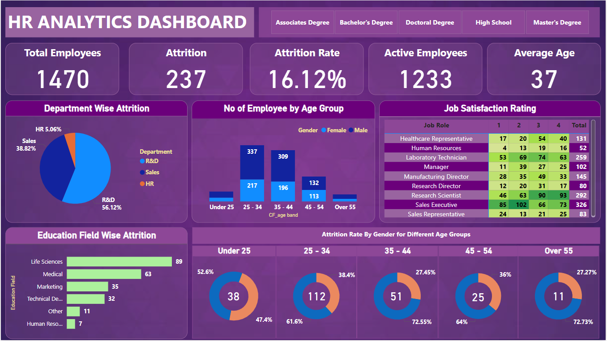

# HR Attrition Analysis Dashboard 
## Project Title: HR Attrition Analysis for Workforce Insights and Retention Strategy
## Objective:
To analyze employee attrition patterns, identify high-risk segments, and provide actionable insights to help HR reduce turnover and improve employee satisfaction.

## Data Source:
Internal HR dataset containing employee demographics, education, job roles, departments, and attrition details.

## Tools Used:
Microsoft Excel for data processing, visualization, and interactive dashboard creation using POWER BI.

## Key Metrics (KPIs):
| Metric     |Value| 
|------------|-----|
| Total Employees      | 1470  | 
| Attrition Count        | 237  | 
| Active Employees    | 1233  | 
| Attrition Rate    | 16.12% |
| Average Employee Age | 37 years |

## Key findings & Insights:

### 1. Department-wise Attrition
→ Sales Department: 38.82% of attrition.

→ R&D Department: 56.12% of attrition.

→ HR Department: 5.06% of attrition.

💡 Recommendation: Focus retention strategies on Sales and R&D teams through growth plans and targeted support.

### 2. Attrition by Age Group
→ Highest attrition in 25–34 years (112 employees).

→ Notable attrition under 25 years (38).

→ 🧠 Insight: Young talent is most likely to leave, often seeking career progression or better compensation.

### 2. Education-wise Attrition
→ Highest attrition from Bachelor's Degree holders (99 employees).

→ Followed by Master's Degree (58) and Associate's Degree (44). 

🎯 Insight: Skilled, mid-level educated employees are leaving more often, possibly for better opportunities.

### 3. Attrition by Job Role
Top roles facing attrition:

→ Sales Executive 

→ Research Scientist 

→ Laboratory Technician 
🚩 Critical Risk Areas: Sales and Research roles need immediate attention to address workload, incentives, or job satisfaction.

## Strategic Insights & Decision-Making Support:

| Challenge                     | Recommendation | 
|-------------------------------|-----------------|
| High turnover in Sales & R&D  | Introduce role-based incentives, skill enhancement, and mental health support.   | 
| Young employee attrition | Build strong career progression paths, competitive salary adjustments, and flexible work options.   | 
| Low job satisfaction (2.6/4)  | Conduct regular feedback surveys and implement well-being programs.   | 
| Education-based exits | Retain skilled employees through learning & development programs and leadership tracks.|
